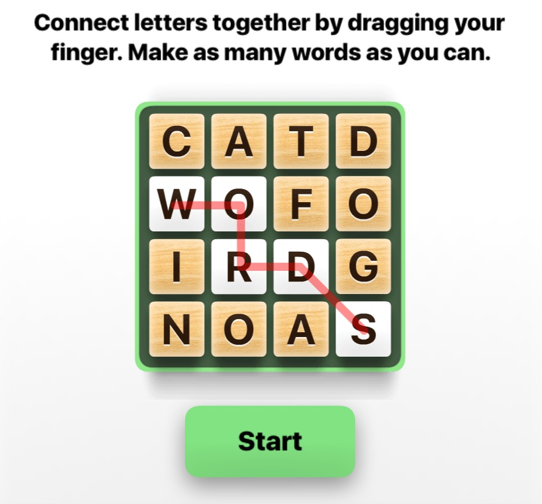

# Word Hunt Solver

Access the link here: [Word Hunt Solver](https://hanlinm2.github.io/word_hunt_solver/) (currently it has only been tested to work on Chrome)

Word Hunt Solver helps player get the longest words in the popular iMessage Game Pigeon game Word Hunt.

To find the longest words, the program uses a recurisive backtracking algorithm to find all possible letter paths and uses binary search to check if the letter path is a word in the list.

Note:
This is still a work in progress. This project uses an new and experiemntal front end tool called Pyscript, so things might break. 